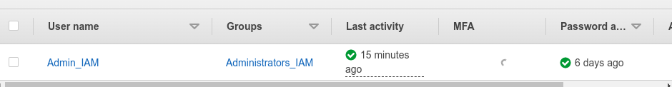
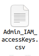
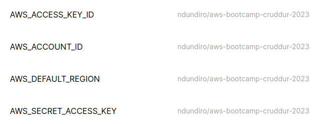
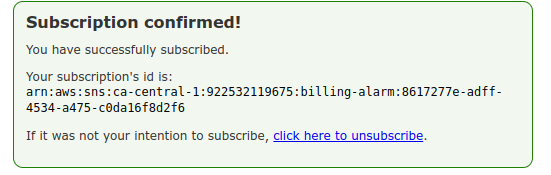

# Week 0 — Billing and Architecture

## Required Homework/Tasks

### Install AWS CLI
I was able to install the AWS cli successfully using the instructions provided. Download the file using curl command, unzip it and install it as sudo.

I updated the .yml file to allow for automatic installation when the gitpod environment launches but somehow it dosent work. I have tried to debug but have not found out the issue because the code is intact as expected but will find it as we continue along.

### Create a new User and Generate AWS Credentials
I was able to create an IAM user, create the Admin group and attach the AdministratorAccess policy to the group.
The administrators permission policy is on the console you just attach.


I created Access keys on the security credentials.


### Set Env Vars
I was able to successfully set my AWS credentials and even have gitpod save the environment variables. I dont have to look up my credentials everytime I open my gitpod workspace.

### Check that the AWS CLI is working and you are the expected user
The ``` aws sts get-caller-identity ``` works as expected.

It returns:
``` 
{
 "UserId": "AIDA5NSZTAR5UG57JWB6B", 
 "Account": "922532119675", 
 "Arn": "arn:aws:iam::922532119675:user/Admin_IAM" 
 } 
 ```
    
### Enable Billing
Saved recieve billing alerts as our billing preference in our root account.
### Creating a Billing Alarm

#### Create SNS Topic
I created an SNS topic and subscribed to the topic on our email.

#### Create Alarm
Created an alarm via CLI. First we created the json file, [alarm_config.json](https://github.com/Ndundiro/aws-bootcamp-cruddur-2023/blob/main/aws/json/alarm_config.json)  and then used the following command and voila there was our cloudwatch put-metric alarm.
``` aws cloudwatch put-metric-alarm --cli-input-json file://aws/json/alarm_config.json ```

### Create an AWS Budget

Creating budgets with CLI was similar to the alarm creation in that you create the json files with what you want them to do. The [budget.json](https://github.com/Ndundiro/aws-bootcamp-cruddur-2023/blob/main/aws/json/budget.json) file.
I created a zero spending budget which notifies me when the spend is above $ 0.01. I have created other budgets but keep on deleting because I dont want to exceed 2 budgets in the free tier.


